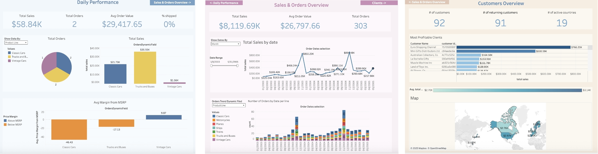

# Sales Dashboard Project (Tableau)
Dashboard from the Sample Sales Data in Kaggale, ETL process made in python (jupyter notebook), visualization with Tableau Public.

View the Sales Dashboard on Tableau Public:
https://public.tableau.com/app/profile/inbar.birman/viz/SalesDashboard_17540726608940/Sheet1

---

## Dashboard Overview

The dashboards are structured to reflect priority and workflow:  
The user starts with daily data, then navigate to historical trends and client insights if they need deeper context.

---

### 1. Daily Performance
**Purpose:**  
Provide an at-a-glance view of today’s performance.

### 2. Sales & Orders Overview

**Purpose:**  
Enable exploration of sales and order trends over time.

### 3. Customers Overview
**Purpose:**  
Identify the most powerful customers and market diversity.

---

## Design Considerations

1. **Order Filtering**  
   - Cancelled orders are excluded from dashboards, but I decided not to drop them from the dataset for possible future canceled-order analysis.  

2. **Dynamic and Efficient**  
   - Created dynamic field selection (e.g., Product Line vs Product Code, Dates) to avoid duplication of the exact same charts with a minor change of the field,         to improve performance.  

3. **"Today" Definition**  
   - For this dataset that contains old data, “Today” = latest order date. In production, this would reflect the actual current date. 

